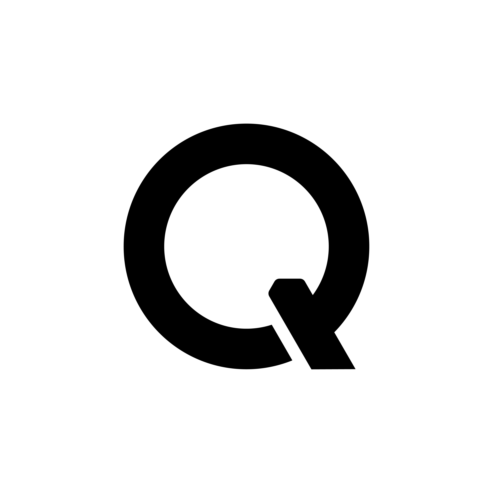

<!-- <p align="center">
  
</p> -->

<h1 align="center">QwenCloud Deployment Skill</h1>

<p align="center">
  Deploy your project to the cloud with a single prompt—let your Agent handle the rest.
</p>

<p align="center">
  <a href="https://github.com/QwenCloud/qwencloud-deploy/blob/main/LICENSE"></a>
  <a href="https://github.com/QwenCloud/qwencloud-deploy/stargazers"></a>
  <a href="https://agentskills.io"></a>
  <a href="https://nodejs.org"></a>
</p>

<p align="center">
  <a href="README_zh.md">简体中文</a>
</p>

---

## Highlights

- 🚀 **Deploy local projects in one step** — Simply tell your Agent to “deploy this project.” It will automatically select a suitable deployment plan, orchestrate the required resources, and bring your application online on Alibaba Cloud International.
- 🔗 **Deploy directly from a Git URL** — Provide a Git repository URL and let the Agent clone, build, and deploy it automatically—no local checkout required.
- 🔥 **Seamless updates** — After modifying your project, simply ask the Agent to “update the project” to publish the latest version.
- 📊 **Observability** — After deployment, say “observe this app” for a read-only checkup of availability, performance, and cost, with a health score and an exportable report.
- 🛠️ **Ops diagnosis** — When the app is down/slow/erroring, say “diagnose this app” to locate the faulty layer and run a safe recovery after your confirmation.
- 🌐 **Domain & HTTPS** — Register a domain, configure DNS, and obtain a free Let's Encrypt SSL certificate—all handled by the Agent in one flow.
- 💰 **Pay as you go** — Pay only for the resources you use (billed in USD) and release them at any time.
- 🤖 **Works with multiple Agents** — Compatible with a wide range of Agents that support [Agent Skills](https://agentskills.io). Install it and start deploying right away.

<p align="center">
  <a href="https://claude.com/claude-code"></a>
  &nbsp;
  <a href="https://www.cursor.com"></a>
  &nbsp;
  <a href="https://github.com/google-gemini/gemini-cli"></a>
  &nbsp;
  <a href="https://chatgpt.com/codex"></a>
  &nbsp;
  <a href="https://cline.bot"></a>
  &nbsp;
  <a href="https://antigravity.google/"></a>
  &nbsp;
  <a href="https://sourcegraph.com/amp"></a>
  &nbsp;
  <a href="https://manus.im"></a>
  &nbsp;
  <a href="https://qwen.ai/qwencode"></a>
  &nbsp;
  <a href="https://qoder.com"></a>
  &nbsp;
  <a href="https://github.com/opencode-ai/opencode"></a>
  &nbsp;
  <a href="https://www.openclaw.ai"></a>
  &nbsp;
  <a href="https://roocode.com"></a>
  &nbsp;
  <a href="https://kilo.ai"></a>
  &nbsp;
  <a href="https://windsurf.com"></a>
  &nbsp;
  <a href="https://github.com/All-Hands-AI/OpenHands"></a>
  &nbsp;
  <a href="https://github.com/block/goose"></a>
  &nbsp;
  <a href="https://www.trae.ai"></a>
  &nbsp;
  <a href="https://kiro.dev"></a>
  &nbsp;
  <a href="https://devin.ai"></a>
  &nbsp;
  <a href="https://www.augmentcode.com"></a>
</p>

---

## Quick Start

### Prerequisites

- Node.js 18+
- [Alibaba Cloud CLI 3.x](https://help.aliyun.com/document_detail/121544.html) (if it is not installed, the Skill will guide you through the installation)

### Installation

```bash
npx skills add QwenCloud/qwencloud-deploy
```

A single install gives you three skills: **deploy · observe · operate**.

### Usage

From a deployed project directory, trigger a capability with one sentence; the Agent guides you and asks for confirmation at key steps.

| Goal | Say to the Agent | skill |
| --- | --- | --- |
| Deploy to the cloud | Deploy this project to the cloud / Deploy `<Git URL>` to Alibaba Cloud | deploy |
| Update | Update the app | deploy |
| Domain + HTTPS | Bind a domain with HTTPS | deploy |
| Delete | Delete this deployment | deploy |
| Check how it's running and what it costs | How is this app doing? | observe |
| Troubleshoot and recover the app | The app won't open, take a look / The site is slow | operate |

> observe and operate rely on the `.qwencloud-deploy` state file produced by deploy, so run them from a deployed project directory.

---

## What the three skills do

### 🚀 deploy

Deploy a local project or Git repository to Alibaba Cloud International in one step, with updates, HTTPS, and cleanup.

- **Full-stack deploy** — analyze the project, orchestrate ECS (+ optional RDS MySQL) + public IP + a temporary OSS bucket, and show an exact USD quote for your confirmation before creating anything.
- **Hot update** — say "update the app" to publish a new version with the public IP unchanged.
- **Domain & HTTPS** — register a domain, configure DNS, and obtain a free Let's Encrypt SSL certificate in one flow.
- **Delete/cleanup** — say "delete this deployment" to release every resource it created (irreversible, double-confirmed).

### 📊 observe

A **read-only** checkup of a deployed app — "how is it running and what will it cost" — without opening the console.

- **Health score** — score four dimensions (app, ECS, RDS, availability) into a health score and grade, each judgment backed by evidence.
- **Per-layer overview** — app probe and latency, ECS CPU/memory/load, RDS connections/slow SQL, public entry and security-group exposure.
- **Cost** — the actual bill broken down by product, with utilization-based optimization notes (no future-spend estimates).
- **Report export** — export a Markdown / HTML report. On a real fault, hand off to operate in one click.

### 🛠️ operate

Fault diagnosis and **confirm-first** recovery for an app that is down or clearly slow.

- **Diagnosis** — read-only, pinpoints the faulty layer (app / Nginx / ECS / RDS / network / disk) and its error.
- **Confirm-first recovery** — proposes one recovery action at a time (start ECS, restart the app service, reload Nginx), explains the impact, and runs it only after you confirm.
- **Closed-loop verification** — re-checks after recovery and reports recovered / partially recovered / not recovered, with an audit record for every write action.

> observe and operate handle infrastructure and runtime only; they do not review or modify your source code — code bugs are yours to fix.

---

## Security

- Passwords are passed via environment variables, never command-line arguments or chat.
- Deployment adds state files and common AI agent directories to `.gitignore`, keeping their credentials out of the repo.
- Before committing, confirm no credential-bearing files are tracked, and rotate any exposed key or password.

---

## Contributing

Contributions are welcome! You can help improve the project in the following ways:

- **Report bugs** — If you encounter an issue, please [open an Issue](https://github.com/QwenCloud/qwencloud-deploy/issues) and include the steps needed to reproduce it.
- **Request features** — Have an idea for a new feature or an improvement? Feel free to submit a Feature Request.
- **Submit a PR** — Fork the repository, create a new branch, make your changes, and open a Pull Request.
- **Improve the documentation** — We welcome typo fixes, clearer wording, and better examples.

---

> **Disclaimer** — This Skill calls Alibaba Cloud APIs on your behalf to create and manage cloud resources. Any resulting charges are billed to your account. An exact quote will be provided for your confirmation before deployment, but variable costs such as traffic charges depend on actual usage. All charges are billed in USD. Deployment plans
> generated by AI may not be fully suitable for production environments. Evaluate their security and reliability before going live, and keep your AccessKey ID and AccessKey Secret (AK/SK) secure. This project is provided for evaluation and reference only, without any guarantee of availability or stability.

## License

[Apache 2.0](LICENSE)
